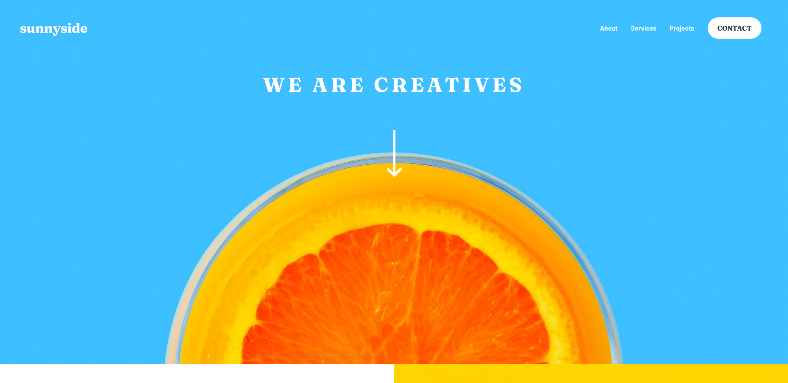

# Frontend Mentor - Sunnyside agency landing page solution

This is a solution to the [Sunnyside agency landing page challenge on Frontend Mentor](https://www.frontendmentor.io/challenges/sunnyside-agency-landing-page-7yVs3B6ef).


## Table of contents

  - [Overview](#overview)
  - [The challenge](#the-challenge)
  - [Screenshot](#screenshot)
  - [Links](#links)
  - [My process](#my-process)
  - [Built with](#built-with)
  - [What I learned](#what-i-learned)
  - [Continued development](#continued-development)
  - [Useful resources](#useful-resources)
  - [Author](#author)
## Overview

Build out the landing page and get it looking as close to the design as possible.

This challenge focuses mostly on HTML & CSS. There's a tiny bit of JS included for the mobile navigation toggle. But you could also choose to do this without JS!

Any tools you like are allowed to help you complete the challenge.
### The challenge

Users should be able to:

- View the optimal layout for the site depending on their device's screen size
- See hover states for all interactive elements on the page

### Screenshot


### Links

- Solution URL: [The github](https://github.com/Everezze/Sunnyside-Agency-Landing-page)
- Live Site URL: [Github live page](https://everezze.github.io/Sunnyside-Agency-Landing-page/)

## My process

As usual I like to ,first, structure the HTML then after that adding styles to it with CSS and finally adding Javascript if necessary for dynamic interaction.

### Built with

- Semantic HTML5 markup
- CSS3
- Flexbox
- Mobile-first workflow
### What I learned

```html
<picture>
  <source>
  
</picture>
```

```css
.proud-of__this-css { //BEM convention used.

  text-transform: capitalize;
  clip-path: polygon();
  fill: #2C7566;
  order:-1;
}
```
### Continued development

Trying to perfect flexbox techniques, as well as starting to use naming convention like BEM. Also I need to focus more on semantics.
### Useful resources

- [To center an absolute element](https://www.youtube.com/watch?v=HWtiX_N2IYg&t=138s) - This helped me for centering an absolute element. I really liked how simple the solution is.
## Author

- Website [My github profil](https://github.com/Everezze)
- Frontend Mentor - [@Everezze](https://www.frontendmentor.io/profile/Everezze)